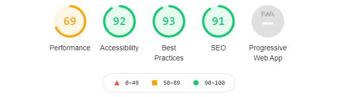

**Table of Contents**

1. [Code Testing](#code-testing)
  - [Automated Testing](#automated-testing)
  - [Validator Testing](#validator-testing)
2. [User Story Testing](#user-story-testing)
3. [Manual Testing](#manual-tesing)
  - [Lighthouse](#ighthouse)
  - [Responsive Testing](#responsive-testing)
   - [Desktop Testing](#desktop-testing)
   - [Tablet Testing](#tablet-testing)
   - [Mobile Testing](#mobile-testing)
4. [Bugs Discovered](#bugs-disccovered)
  - [Resolved Bugs](#resolved-bugs)
  - [Unresolved Bugs](#unresolved-bugs)
5. [Defensive Design](#defensive-design)
  - [Navbar](#navbar)
  - [Footer](#footer)
  - [Login/Signup](#login/signup)
  - [Products](#products)
  - [Checkout](#checkout)
  - [Blog](#blog)
 

# Code Testing 

## Automated Testing 

In addition to the full manual testing, I also decided to add some automated testing, as advised in the short testing section of the course. The automated testing can be improved.
I am not 100% confident with automated testing just yet! 

I created 11 automated tests in total. These include:

Checkout>tests.py: Order form testing
Products>tests.py: Product form testing and Product page view test

- In the terminal type the following command:
  `python manage.py test <<app name>>`
- The test results will be shown within the terminal.

## Validator Testing 

[W3C Markup Validation](https://validator.w3.org/nu/#textarea)

- HTML 

  
- CSS
 - No errors or warnings displayed
 

 [JSHINT](https://jshint.com/)

- When run through the [JSHint validator](https://jshint.com/) these metrics were returned:
 - There are 5 functions in this file.
 - Function with the largest signature take 1 arguments, while the median is 1.
 - Largest function has 10 statements in it, while the median is 5.
 - The most complex function has a cyclomatic complexity value of 3 while the median is 1.
 
[Python PEP8](https://pypi.org/project/autopep8/)

- The autopep8 extension was installed in the workspace.

- To install this enter this in the terminal:
  - `pip3 install --upgrade autopep8`

- Each and every .py file has been check over to make sure it complies with PEP8 formatting rules, both manually in the Gitpod window, as well as running the code through http://pep8online.com/.

There are no errors through the PEP8 check. However, there are a couple of highlighted rows of code where I have decided not to make the suggested corrections:
 - ‘Avoid using null=True on string based fields.’ Pages with error: Blog>models.py & products>models.py I have left this error as it is a string path to a source file.
 - ‘Avoid using null=True on string based fields.’ Pages with error: checkout>models.py, profiles>models.py, product>models.py
 - ‘Line too long’ Pages with error: settings.py, checkout>webhooks.py, checkout>webhook_handler.py, checkout>models.py These have been left as is as these lines should not be broken.

# User Story Testing

## As a site user, I want to be able to:
- Easily register for an account, so that I can be able to have a personal account and be able to view my profile
- Easily login and logout, so that I can access my personal account and easily logout to quit the session
- Easily recover my password if I forget it so that I can recover access to my account
- Have a personalised user account so that I can view my personal order history and order confirmations, and save my payment information
- Easily navigate to the blog so that I can read the latest blog posts
- See short descriptions of each blog, so that I can quickly decide which blog post I would like to read
- Easily navigate to the blog post details so that I can read the full blog post to learn new information about jewellery
- Easily leave comments, pending approval by the site user so that I can express my thoughts on the blog post 

## As a site owner, I want to be able to:
- Easily add new products to sell, so that I can keep my store reflecting new products in my inventory
- Easily edit/update existing products that are listed, so that I can keep my products listing up to date with the correct information 
- Quickly delete products should they no longer be available to the shopper, so that I can make sure the shopper does not select a product that is no longer available 
- Easily create new blog post, edit existing blog posts and delete blog posts, so that I can keep my blog up to date with new posts and delete post that may no longer be relevant

## As a shopper, I want to be able to:
- Sort the list of available products so that I can easily identify the best rated, best priced and categorically sorted products
- Sort a specific category of product so that I can find the best rated or best priced product within a specific category
- Sort multiple categories of products simultaneously so that I can find the best rated or best priced product within a specific category such as 'rings' or 'necklaces'
- Sort for a product by name, description and artist so that I can Find a specific product with known keywords
- Easily see what I have searched for so that I can quickly see if the product I have searched for is available
- Easily select the quantity of a product when purchasing it so that I can ensure I dont select the wrong product, or quantity
- Adjust the quantity of items I would like to buy, so that I can make sure that I am buying the desired amount
- Easily see the subtotal for each item, so that I can get an idea of how much I am spending on each item 
- Safely and securely use my card details to make the payment, so that I can have peace of mind that the payment is safe
- Save my details on the site, so that I can be a return shopper without the hassle of re-entering all of my details 
- View an order confirmation after checkout, so that I can verify that I have not made any mistakes
- Receive an email confirmation after checkout, so that I can keep the confirmation of what I have purchased in my records

# Manual Testing

## Lighthouse

- An audit was completed using Lighthouse on the Rivercity jewellery. 
- Quite a low performance but upon completing audits of several other websites, such as: 
 - [Code Like a Girl](https://code.likeagirl.io/) 
 - [Medium](https://medium.com/) 

I learned that higher markings in Accessibility, Best Practices & SEO were more frequent than having a high-performance rating.

## Responsive testing

### Desktop Testing

| Page          | Responsive    | Notes |
| ------------- |:-------------:| -----:|
| Index      | |  |
| Products      |       |    |
| Product Details |       |     |
| Shopping Bag |      |     |
| Checkout |      |     |
| Checkout Successful |       |    |
| Blog |     |     |
| Blog Details|      |     |
| Sign Up |       |     |
| Login |       |     |

### Tablet Testing

| Page          | Responsive    | Notes |
| ------------- |:-------------:| -----:|
| Index      | |  |
| Products      |       |    |
| Product Details |       |     |
| Shopping Bag |      |     |
| Checkout |      |     |
| Checkout Successful |       |    |
| Blog |     |     |
| Blog Details|      |     |
| Sign Up |       |     |
| Login |       |     |

### Mobile testing

| Page          | Responsive    | Notes |
| ------------- |:-------------:| -----:|
| Index      | |  |
| Products      |       |    |
| Product Details |       |     |
| Shopping Bag |      |     |
| Checkout |      |     |
| Checkout Successful |       |    |
| Blog |     |     |
| Blog Details|      |     |
| Sign Up |       |     |
| Login |       |     |

# Bugs disccovered

## Resolved Bugs
## Unresolved Bugs

# Defensive Design

## Navbar
- 
- 
## Footer
- 
- 
## Login/Signup
- 
- 
## Products
- 
- 
## Checkout
- 
- 
## Blog
- 
- 